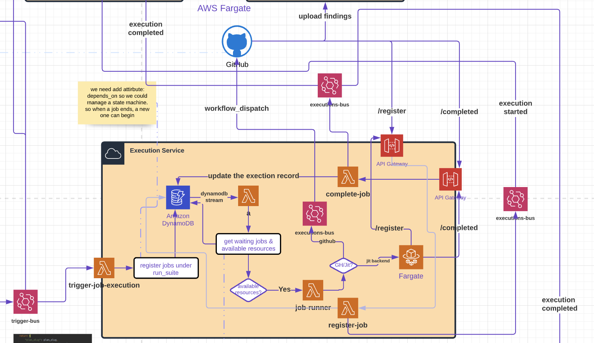

[<- back](https://redesigned-broccoli-e56e9071.pages.github.io/Projects/Execution/)

# Execution Service

# Description

The Execution service should replace most of the functionalities that were in the workflow service before. </br>
The Execution service is responsible for executing jobs. </br>
It receives events from the trigger service and understands where it should run and with </br>
which data based on the event's data. After it is all prepared, it executes it.

# Architecture

[](https://lucid.app/lucidchart/964bbcb3-34a7-46f5-b5c4-16ca177cb0a5/edit?page=yEH01FlWmJqo#)

# Flows

## 1. Executing a job

The trigger service sends jobs that are received by the "trigger-execution" lambda. The "trigger-execution" lambda
retrieves data from the asset service. Using both the asset table data and the event data, it builds an Execution
object, which it saves in the Execution Table.

The data insertion into the table triggers a DynamoDB stream, triggering the allocate-runner-resource lambda. This
lambda validates that the tenant has free resources that can be used to run the executions. If so, it sends it to the
enrich-and-dispatch lambda.

The enrich-and-dispatch lambda has two responsibilities:
Enrich - Prepare the data for the execution Dispatch - Send it to the runner.

# Interfaces

## Endpoints

### [GET] Get Executions by filter

- Description
    - Returns a list of executions that match the filter, and belongs to the tenant.
- Filters:
    - status: completed, failed, pending
    - plan_item_slug: slug of the plan item
- Request: `GET /executions?status={status}&plan_item_slug={plan_item_slug}`
- Response: HTTP 200

```json
{
  "PK": "TENANT#92c4b3cc-ebdb-4662-8dbd-765a2e3b3af4",
  "SK": "JIT_EVENT#00a354e2-d393-4694-bc54-dde7554dfced#RUN#490de6d6113c4deba97856c5b0cbf17c",
  "status": "completed",
  "GSI1SK": "2022-04-24T11:30:18.143407",
  "vendor": "github",
  "GSI3SK": "2022-04-24T11:30:18.143407",
  "asset_id": "81282625-8050-4305-8655-4f8fbc357921",
  "jit_event_name": "pull_request_created",
  "GSI2SK": "2022-04-24T11:30:18.143407",
  "GSI4SK": "2022-04-24T11:30:18.143407",
  "jit_event_id": "00a354e2-d393-4694-bc54-dde7554dfced",
  "execution_id": "490de6d6113c4deba97856c5b0cbf17c",
  "has_findings": false,
  "plan_item_slug": "item-code-vulnerability",
  "created_at": "2022-04-24T11:30:18.143407",
  "created_at_ts": 1650789018,
  "entity_type": "job",
  "workflow_slug": "workflow-sast",
  "asset_name": "execution-service",
  "control_image": "ghcr.io/jitsecurity-controls/control-bandit-slim:latest",
  "control_name": "Run Bandit",
  "GSI2PK": "TENANT#92c4b3cc-ebdb-4662-8dbd-765a2e3b3af4#STATUS#completed",
  "GSI1PK": "TENANT#92c4b3cc-ebdb-4662-8dbd-765a2e3b3af4",
  "completed_at": "2022-04-24T11:30:53.416005",
  "completed_at_ts": 1650789053,
  "GSI4PK": "TENANT#92c4b3cc-ebdb-4662-8dbd-765a2e3b3af4#PLAN_ITEM#item-code-vulnerability#STATUS#completed",
  "GSI3PK": "TENANT#92c4b3cc-ebdb-4662-8dbd-765a2e3b3af4#PLAN_ITEM#item-code-vulnerability",
  "job_name": "static-code-analysis-python",
  "tenant_id": "92c4b3cc-ebdb-4662-8dbd-765a2e3b3af4",
  "steps": [
    {
      "name": "Run Bandit",
      "params": {
        "args": "-r /code -f json -q -ll -iii"
      },
      "uses": "ghcr.io/jitsecurity-controls/control-bandit-slim:latest"
    }
  ],
  "job_runner": "github_actions",
  "additional_attributes": {
    "owner": "jitsecurity",
    "user_vendor_name": "jitsecurity",
    "original_repository": "execution-service",
    "user_vendor_id": "62615683",
    "languages": [
      "python",
      "any"
    ],
    "pull_request_number": "22",
    "installation_id": "24915845",
    "commits": {
      "head_sha": "d3ee6efdf02df6fbfef28f916c359b23e9131c1a",
      "base_sha": "045f333e854d65ba6aa04c9a27b8386a377455f4"
    },
    "type": "AdditionalAttributesCode",
    "app_id": "161076",
    "branch": "main"
  },
  "plan_slug": "jit-plan",
  "asset_type": "repo",
  "registered_at": "2022-04-24T11:30:51.020502",
  "registered_at_ts": 1650789018
}
```

- Authentication/Authorization: `jit-auth`
- Availability: public


## Event subscriptions
### trigger-execution
```json
{
}
```


## Event Publications

List the events that this service publish. Include the event body.

# Data model

## Access pattern

Example

1. Get N Executions by tenant_id ordered by creation time
2. Get N Executions by tenant_id and status ordered by creation time
3. Get N Executions by tenant_id and plan_item_slug ordered by creation time
4. Get N Executions by tenant_id and status and plan_item_slug ordered by creation time
5. Update Execution by jit_event_id and execution_id

## Entity chart

List a table with all the entities and their associated primary keys/secondary indexes. Example:

| Entity    | PK                 | SK                                               |
|-----------|--------------------|--------------------------------------------------|
| Execution | TENANT#<tenant_id> | JIT_EVENT_ID#<event_id>#EXECUTION#<execution_id> |

| Entity    | GSI1PK             | GSI1SK        | GSI2PK                             | GSI2SK        | GSI3PK                                        | GSI3SK        | GSI4PK                                                      | GSI4SK        |
|-----------|--------------------|---------------|------------------------------------|---------------|-----------------------------------------------|---------------|-------------------------------------------------------------|---------------|
| Execution | TENANT#<tenant_id> | creation_time | TENANT#<tenant_id>#STATUS#<status> | creation_time | TENANT#<tenant_id>#PLAN_ITEM#<plan_item_slug> | creation_time | TENANT#<tenant_id#PLAN_ITEM#<plan_item_slug>#STATUS<status> | creation_time |
